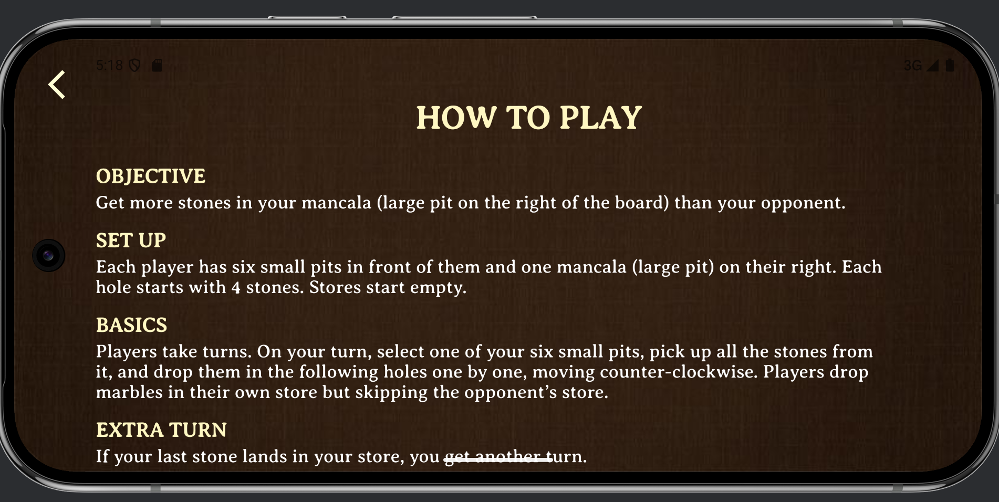
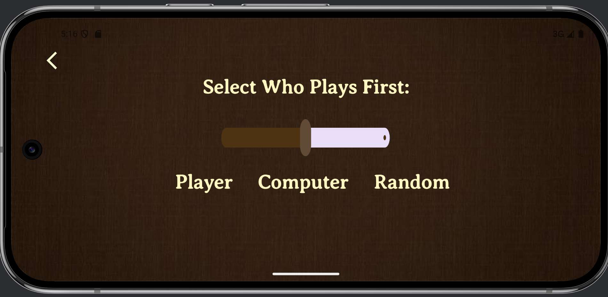

# Mancala Android App

Hello! This is a Mancala app where users can play against the computer at three difficulty levels- easy, medium and hard. The app features marble animations, live scoring, a how to play page, first-move settings, and a different computer player algorithm for each level. 

**Demo Video:** https://github.com/Juliatduffy/Mancala/blob/master/Mancala-Demo-Vid.mp4  

# Features

### Computer Player Algorithms
- **Easy**: Random pit selection  
- **Medium**: Greedy algorithm that chooses the best next move (only looks 1 move ahead)
- **Hard**: Minimax with alpha-beta pruning & memoization (looks up to 12 moves ahead)

### Marble Animations
- Marbles moved one by one  
- Capture effects  
- End-of-game collection animation  

### UI & Gameplay
- **Real-time scoreboard** with helpful captions throughout the game
- **Settings** page with a slider to choose who moves first (player, bot, or random)
- **How-to-Play** page with concise rules 
- **Game Over** screen showing final tally, replay or return home  

## Project Structure

- **`app/src/main/java/com/example/mancala/`**
  - `HomeFragment.kt`
  - `HomeViewModel.kt`
  - `SettingsFragment.kt`
  - `HowToFragment.kt`
  - `GameFragment.kt`
  - `GameViewModel.kt`
  - `ComputerPlayer.kt`
  - `GameOverFragment.kt`
- **`app/src/main/java/com/example/mancala/`**
  - `ComputerPlayerTest.kt`
  - `GameViewModelTest.kt`
- **`app/src/main/res/layout/`**
  - `activity_main.xml`
  - `activity_splash_screen.xml`
  - `fragment_home.xml`
  - `fragment_settings.xml`
  - `fragment_how_to.xml`
  - `fragment_game.xml`
  - `fragment_game_over.xml`
- **`app/src/main/res/navigation/`**
  - `nav_graph.xml`
- **`app/src/main/res/drawable/`**
  - board images, marble assets, hole images

# Screenshots

# Credits

## Author
Julia Duffy, Summer 2025

## Sources
- General Kotlin Help: https://github.com/CS4530-S2025/CodeExamples
- Nav Graph – https://developer.android.com/guide/navigation  
- JUnit & AndroidX Test: https://junit.org, https://developer.android.com/training/testing  
- Minimax Tutorial #1: https://youtu.be/l-hh51ncgDI?si=eH3lZXYamvsOsmiF
- Minimax Tutorial #2: https://youtu.be/fT3YWCKvuQE?si=3F_1iwr31HOBGGNX
- Alpha Beta Pruning: https://mathspp.com/blog/minimax-algorithm-and-alpha-beta-pruning

